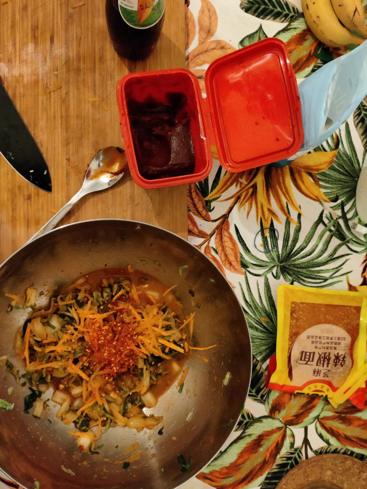

I am a firm believer in building an ugly system quickly and then iterating on it. APIs do not need to be perfect on their first release. Getting something shipped and then being able to ask for feedback is infinitely more valuable than trying to imagine what customers could possibly want. There will always be refactoring that needs to be done, small improvements, changes to taste, and refactoring. The Linux kernel is still under active development and perfection is the enemy of progress. I, therefore, introduce you to my Minimal Viable Product Kimchi.

Is it the perfect kimchi recipe? No, of course not. It misses all of the nuances of centuries of Korean guidance. Is it good enough where you can say "this is kimchi"? Absolutely. For making soups, porridge, and barbecues at home this absolutely serves the purpose it needs to. It is also enough of a kimchi recipe for me to hand over to people, ask what they think, and then next time include those suggestions. You won't know fully understand what customers expect from the scope of your product until you build something and ship it. This is that something.

Ingredients
-----------

Like assessing any product, recipe, or project we need to fully understand what we have to work with, what limitations we have, and what tradeoffs we have to make. Using a more familiar database to allow for faster development time or using whatever ingredients your local German supermarket has are tradeoffs that will lead to faster development. Using what is initially available and then assessing the impact and effectiveness is good practice in coding and cooking.

*   1 Chinese Cabbage
*   Salt
*   2 Cloves of Garlic
*   1/2 a carrot
*   A small piece of ginger
*   1 Spring Onion
*   1 cup chilli flakes
*   Fish sauce
*   2 Tbsp Gochujang

Process
-------

As important as the process itself is, it is equally as important to document the process. When making Minimal Viable Product Kimchi you will be making tradeoffs all over the place. Your first batch might taste a bit funky, and a bit weird, and the only way to understand what went wrong is if you have documented the process. Too spicy? Fewer chili flakes next time! Your project is deep in development and there are no tests? Start with test-driven development next time! [Recipes and Architecture Decision Records](https://docs.aws.amazon.com/prescriptive-guidance/latest/architectural-decision-records/adr-process.html) are great ways to nail down what went wrong.

1.  Dice up cabbage into chunks and add to a large mixing bowl.
2.  Cover cabbage in 2% of its weight in salt and massage it until the cabbage becomes small in size and releases a lot of fluid. Let sit for 5 minutes then rinse cabbage three times to remove most of the salt
3.  Add two diced cloves of garlic, a small amount of ginger (to taste), 2 Tbsps of Gochujang sauce, a shredded carrot, your chilli flakes and 2 dashes of fish sauce. Massage all this together and let sit for 2 minutes.
4.  Pack all of this into a mason jar and push down so the water covers the contents. The water covering the contents is important for fermentation (keeps o2 out, lets co2 escape)
5.  Let your new kimchi sit overnight and check the next morning if small bubbles have started forming around the cabbage. This is the sign that your kimchi is alive!
6.  "Burp" the container every couple of days by opening it and letting the co2 escape. Let this sit from anywhere between 1 week and 3 months. The longer you leave it the better it gets!

Celebrate success!
------------------

Hey, you made something cool! Whether it's kimchi or an API: you need to let people know that you made it! Celebrate with your team/sous chef in public and praise people where it needs to be done. If there is negative feedback, which is very common for my cooking, make sure to do it personally and privately. The world doesn't need to know that the kimchi tastes like it was made by a toddler - only the chef does. Bringing negative feedback with a clear direction and outcome will help the development of the next batch.

 Minimal Viable Product Kimchi being assembled
